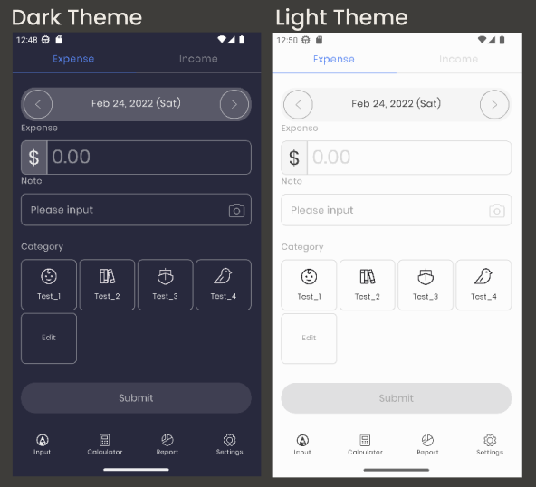

# MonoApp
MonoApp is an app for controlling your income and expenses created with [Jetpack Compose](https://developer.android.com/jetpack/compose). The goal of this project is to acquire new and improved skills in using Compose and other libraries.

To try this program, use the latest stable version of [Android Studio](https://developer.android.com/studio). You can either clone this repository or import the project from Android Studio by following the steps here.

[UI/UX design](https://ui8.net/lhtai1995/products/mono-moneynotes)

## Screenshots

## Used libraries
- [Hilt](https://dagger.dev/hilt/)
- [Room](https://developer.android.com/jetpack/androidx/releases/room)
- [Compose Destination](https://composedestinations.rafaelcosta.xyz/)
